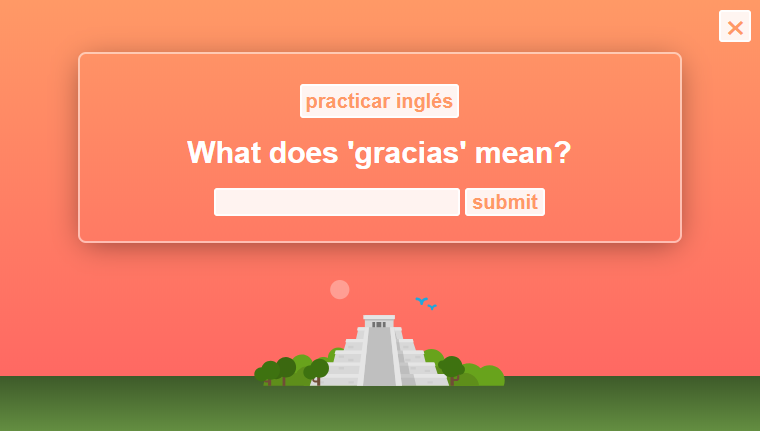

# Spanglish

[Spanglish](https://leo-spaced-rep-client.herokuapp.com/dashboard) uses the power of spaced repetition to help users learn vocab words in Spanish and English. 

**Demo Account** 
user: demo 
password: password 

## Screenshots

Login Page

Dashboard

## View the Backend code here:
https://github.com/thinkful-ei21/Spaced-Rep-Leo-Aram-Server

## Tech Used

### Front-End
* React
* Redux
* HTML
* CSS

### Back-End
* Node
* Express
* MongoDB
* Mongoose
* Passport
* Bcrypt

### Deployment
* Heroku
* mLab
  
